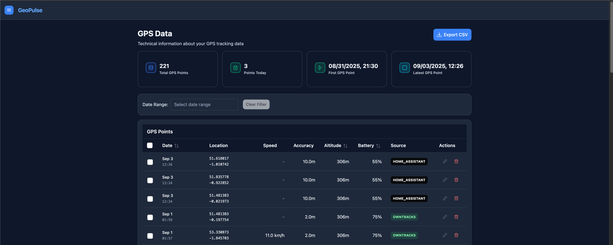

# GeoPulse

<div align="center">
  

**A self-hosted location tracking and analysis platform**

[](LICENSE)
[](docs/DEPLOYMENT_GUIDE.md)
[](#)
[](#)
</div>

---

GeoPulse transforms raw GPS data from tracking apps like OwnTracks, Overland, Dawarich or HomeAsssitant into organized
timelines and
insights. It automatically categorizes your location data into stays and trips, providing a clear view of your movement
patterns while keeping everything on your own server. GeoPulse has integration with Immich server so you can view your
photos directly on the timeline map.

<div align="center">
  
  <p><em>Interactive timeline with automatic stay/trip detection and map visualization</em></p>
</div>

## 🚀 Getting Started

GeoPulse can be deployed using **Docker Compose** or **Kubernetes (Helm)**.

### Quick Start with Docker

Deploy GeoPulse in under 5 minutes:

**Choose your deployment scenario:**

- 🏠 **Local Deployment** - Deploy on your local machine (zero configuration required)
- 🌐 **Production** - Deploy on server with domain and reverse proxy

Both scenarios optionally support MQTT for real-time OwnTracks integration.

**Simple deployment process:**

1. Download single `.env` configuration (works without changes for local Deployment)
2. Download `docker-compose` file
3. Run `docker compose up -d`

**👉 [Docker Deployment Instructions](docs/DEPLOYMENT_GUIDE.md)**

Once deployed:

- **Local Deployment**: http://localhost:5555
- **Production**: https://your-domain.com

### Kubernetes Deployment

For Kubernetes clusters, GeoPulse provides official Helm charts:

```bash
helm install geopulse ./helm/geopulse --namespace default --set mosquitto.enabled=true
```

**👉 [Kubernetes/Helm Deployment Instructions](docs/DEPLOYMENT_GUIDE.md#kubernetes-deployment-with-helm)**

---

## Features

**GPS Data Integration**

- Works with OwnTracks (HTTP or MQTT), Overland, Dawarich and HomeAssistant tracking apps
- Real-time data sync with GPS tracking apps.
- Manual import from Google Timeline, GPX files

**Timeline and Maps**

- Automatic categorization of GPS data into stays, trips and data gap when no GPS is available
- Interactive maps showing your complete movement history
- Immich integration to show your photos on the timeline map
- Flexible date range viewing (single day to months of data)

**Analytics**

- Dashboard with distance traveled and visit statistics
- Journey insights showing countries and cities visited
- Movement pattern analysis and activity tracking
- AI-powered location insights and intelligent data analysis

**AI Chat Assistant**

- Ask questions about your location data and get intelligent insights
- Natural language queries about travel patterns, visits, and habits
- Powered by OpenAI with secure API key encryption (each user needs to provide their own API Key)

**Social Features**

- Connect with friends to share locations
- Real-time friend location sharing
- Privacy controls for what and when you share

**Sharing**

- Public share links for non-registered users
- Time-limited and password-protected access
- Temporary, revocable sharing links

**Places Management**

- Save favorite locations and areas
- Add/Edit/Delete favorite places directly on the map
- Reverse geocoding using `Nomatim`, `Google Maps` or `Mapbox API`.

**Customization**

- Adjustable timeline sensitivity settings individually for each user
- Data export in multiple formats
- Dark/light themes with system preference detection
- Mobile-responsive design

## 📚 Complete Documentation

### Detailed Guides

- **[Deployment Guide](docs/DEPLOYMENT_GUIDE.md)** - Comprehensive deployment options and troubleshooting
- **[Configuration Guide](docs/CONFIGURATION.md)** - Advanced configuration and environment variables
- **[Setup Guide](docs/SETUP.md)** - GPS sources setup and initial configuration

## Architecture

- **Backend**: Java with Quarkus framework
- **Database**: PostGIS (PostgreSQL with geographic extensions)
- **Frontend**: Vue.js 3 with PrimeVue components
- **Maps**: Leaflet with OpenStreetMap
- **Deployment**: Docker Compose, Kubernetes (Helm Charts)
- **MQTT broker**: Mosquitto (optional, used for OwnTracks MQTT integration)

## Compatible Apps

**OwnTracks** (iOS, Android)
**Overland** (iOS)
**Dawarich** (iOS)
**Home Assistant**

## Authentication

GeoPulse supports multiple authentication methods:

**Traditional Authentication**
- Username/password registration and login
- Secure password hashing and JWT tokens

**OIDC/SSO Authentication** 
- OpenID Connect support for enterprise SSO
- Compatible with Google, Microsoft, Keycloak, Auth0, and more
- Multiple providers can be configured simultaneously
- Account linking for users with existing accounts

See the [Configuration Guide](docs/CONFIGURATION.md#oidc-authentication) for OIDC setup instructions.

## Privacy and Security

GeoPulse keeps your data under your control:

- Self-hosted - your data stays on your server
- No third-party tracking or external data sharing
- Secure HTTP-only cookies with JWT tokens for API access
- OIDC/SSO integration for enterprise environments
- Granular sharing controls
- Full data export capabilities

## Screenshots

### Timeline View

<div align="center">
  
</div>

### Dashboard

<div align="center">
  
</div>

### GPS Data

<details>
<summary>GPS Data Management page</summary>
<div align="center">
  
</div>
</details>

### Additional Views

<details>
<summary>Journey Insights & Analytics</summary>


</details>

<details>
<summary>Configuration & Setup</summary>


</details>

<details>
<summary>Data Management</summary>


</details>

## License

AGPL-3.0 with Non-Commercial Use Restriction  
See [LICENSE](./LICENSE) for details.