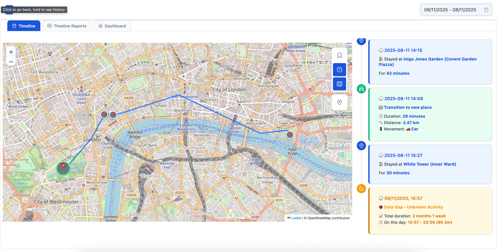
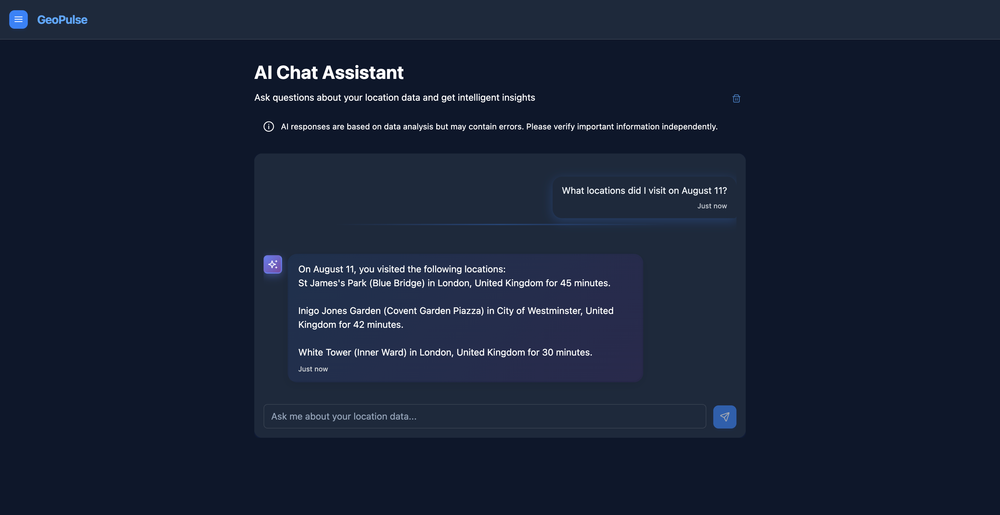

# GeoPulse

<p align="center">
  
</p>

**A self-hosted location tracking and analysis platform**

[](LICENSE)
[](docs/DEPLOYMENT_GUIDE.md)
[](#)
[](#)

---

GeoPulse transforms raw GPS data from tracking apps like OwnTracks, Overland, Dawarich, GPSLogger or Home Assistant into organized
timelines and insights. It automatically categorizes your location data into stays and trips, providing a clear view of
your movement patterns while keeping everything on your own server. GeoPulse seamlessly integrates with Immich, allowing
you to view your photos directly on the timeline map.

<div align="center">
  
  <p><em>Interactive timeline with automatic stay/trip detection and map visualization</em></p>
</div>

## Table of Contents

- [Why GeoPulse?](#why-geopulse)
- [Who Is This For?](#who-is-this-for)
- [Quick Start](#quick-start)
- [Deployment Options](#deployment-options)
- [System Requirements](#system-requirements)
- [Features](#features)
- [Documentation](#documentation)
- [Architecture & Technology](#architecture--technology)
- [Compatible GPS Tracking Apps](#compatible-gps-tracking-apps)
- [Authentication & Security](#authentication--security)
- [Privacy & Security](#privacy--security)
- [Screenshots](#screenshots)
- [Project Status](#project-status)
- [License](#license)

## Why GeoPulse?

**Reliable & Configurable Timeline Generation**

GeoPulse features an advanced algorithm that automatically categorizes your GPS data into stays and trips. Each user can
adjust timeline sensitivity settings to match their needs, ensuring accurate categorization whether you're walking,
driving, or traveling. The system also detects data gaps when GPS is unavailable.

**Universal GPS Compatibility**

Works with all major GPS tracking apps including OwnTracks, Overland, GPSLogger, Dawarich, and Home Assistant. Import
your existing location data from Google Timeline, GPX, GeoJSON, OwnTracks, or CSV formats. Real-time sync via HTTP or
MQTT.

**Performance & Reliability**

Built with Java (Quarkus native) and PostGIS for maximum reliability and efficiency. GeoPulse uses only **40-100MB of
memory** compared to 500-1000+MB for similar applications, while maintaining excellent performance with low-level
optimizations for GPS data processing. Can handle years of location history.

**Mobile-First Design**

Every page is fully optimized for mobile devices, providing a seamless experience whether you're on a phone, tablet, or
desktop.

## Who Is This For?

GeoPulse is ideal for:

- **Individuals** who want a private alternative to Google Timeline
- **Families or friends** who want optional real-time location sharing
- **Self-hosters** who value performance and low resource usage
- **Power users** who want full control over their GPS data and timeline configuration
- **Teams or organizations** needing internal location tracking (non-commercial use)

GeoPulse is **not** intended for commercial SaaS use without a commercial license. See [License](#license) for details.

## Quick Start

New to GeoPulse? Follow our **[Quick Start Guide](https://tess1o.github.io/geopulse/docs/getting-started/quick-start)**
to:

- Import existing location data
- Configure GPS tracking apps
- Explore your timeline and insights

## Deployment Options

GeoPulse can be deployed using **Docker Compose** or **Kubernetes (Helm)** in under 5 minutes.

### Docker Compose

**Choose your deployment scenario:**

- **Local Deployment** - Deploy on your local machine (zero configuration required)
- **Production Deployment** - Deploy on server with custom domain and reverse proxy
- **With MQTT** - Real-time OwnTracks integration

**[Docker Deployment Guide](https://tess1o.github.io/geopulse/docs/getting-started/deployment/docker-compose)**

Once deployed:

- **Local**: http://localhost:5555
- **Production**: https://your-domain.com

### Kubernetes / Helm

For production clusters and high-availability deployments:

```shell
helm repo add geopulse https://tess1o.github.io/geopulse/charts
helm repo update
helm install my-geopulse geopulse/geopulse
```

**[Kubernetes Guide](https://tess1o.github.io/geopulse/docs/getting-started/deployment/kubernetes-helm)** | *
*[Helm Configuration](https://tess1o.github.io/geopulse/docs/getting-started/deployment/helm)**

### After Deployment

1. Set `GEOPULSE_ADMIN_EMAIL` environment variable to designate the first admin user
2. Create your first account with the admin email
3. Configure system settings via the Admin Panel
4. Import existing data or set up GPS tracking apps

**[Initial Setup Guide](https://tess1o.github.io/geopulse/docs/system-administration/initial-setup)**

---

## System Requirements

**Minimal Requirements for Regular Usage:**

- **RAM**: 512MB (typical usage is much less, but recommended for comfortable operation)
- **CPU**: 1-2 vCPU
- **Storage**: Depends on data volume (GPS points, photos if using Immich integration)

**Notes:**

- Initial data migration is well-optimized with constant memory usage regardless of data size
- You may want to allocate more resources during large initial imports for better performance
- Production deployments with many users may benefit from additional resources

---

## Features

### For End Users

**Timeline & Location History**

- Automatic categorization of GPS data into stays, trips, and data gaps
- Interactive maps showing your complete movement history
- **Rewind** - Monthly and yearly statistics and insights about your location patterns
- Immich integration to view photos directly on the timeline
- Flexible date range viewing (single day to months of data)

**Analytics & Insights**

- **Dashboard** - Distance traveled, visit statistics, and activity tracking
- **Journey Insights** - Deep analysis of countries and cities visited, achievement badges
- Movement pattern analysis
- AI-powered location insights and intelligent data analysis

**GPS Data Integration**

- Works with all major GPS tracking apps (see [Compatible Apps](#compatible-gps-tracking-apps))
- Real-time data sync via HTTP or MQTT
- Import from Google Timeline, GPX, GeoJSON, OwnTracks, or CSV formats

**AI Chat Assistant**

- Ask questions about your location data in natural language
- Intelligent insights about travel patterns, visits, and habits
- Use any OpenAI-compatible service (users provide their own API key)

**AI Assistant Privacy:**

- AI features are **optional and disabled by default**
- Users must provide their own OpenAI-compatible API key
- Location data is sent only to the user's configured AI provider
- No AI data is shared with GeoPulse servers or third parties

**Places & Organization**

- Save favorite locations and areas
- Add/Edit/Delete places directly on the map
- Reverse geocoding using Nominatim, Photon, Google Maps, or Mapbox API
- Automatic place recognition

**Sharing & Collaboration**

**Friends Feature**

- Add friends and see their real-time location (they must accept your invitation)
- Always stay connected - see where your friends are at any time
- Privacy controls for what location data you share with friends

**Real-Time Location Sharing**

- Share your current location in real-time (perfect for long car trips or live tracking)
- Generate secure sharing links accessible even to guests (no account required)
- Password protection available
- Temporary and revocable links

**Timeline Sharing**

- Share your past visits and trips for specific time periods (e.g., vacation timeline)
- Share future planned trips
- Accessible to guests without GeoPulse accounts
- Password protection available
- Control exactly what timeline data is shared

**Personalization**

- Adjustable timeline sensitivity settings per user
- **Custom map tiles** - Satellite imagery, terrain, custom styles from MapTiler, Mapbox, etc.
- **Measurement units** - Metric, imperial, or mixed units
- Dark/light themes

### For Administrators

GeoPulse includes a comprehensive Admin Panel for managing multi-user deployments:

**User Management**

- Search, view, and manage all user accounts
- Enable/disable user accounts
- Change user roles (USER ↔ ADMIN)
- Reset user passwords
- Delete users and their data
- View per-user statistics (GPS points, activity)

**User Invitations**

- Generate secure, one-time registration links
- Customizable expiration dates (default: 7 days)
- Works even when public registration is disabled
- Complete audit trail of invitation usage

**OIDC/SSO Management**

- Add and configure OIDC providers via web UI (no redeployment needed)
- Test provider connectivity
- Support for multiple providers simultaneously
- Account linking for users with existing accounts
- See [Authentication & Security](#authentication--security) for details

**System Settings**

- Configure authentication behavior (registration options, auto-linking)
- Manage reverse geocoding providers and fallback options
- Adjust GPS processing parameters system-wide
- Configure timezone and locale defaults

**Audit Logs**

- Complete action history for all administrative operations
- Filter by date range, action type, target type, and admin user
- IP address tracking for security
- Detailed before/after values for all changes

**Admin Dashboard**

- System overview with key metrics (total users, active users, GPS points)
- Quick access to all admin functions

Access the Admin Panel at `/app/admin` (requires ADMIN role)

**[Admin Panel Documentation](https://tess1o.github.io/geopulse/docs/system-administration/configuration/admin-panel)**

### Advanced Features

**Monitoring & Observability**

- Prometheus metrics for system health and performance monitoring
- Backend metrics, database stats, request rates
- Integration with Grafana and alerting systems

**Data Management**

- **Backup & Restore** - Complete data export/import
- Export to GPX, GeoJSON, CSV for external analysis
- Streaming parsers handle files up to 2GB
- [Backup & Restore Guide](https://tess1o.github.io/geopulse/docs/system-administration/maintenance/backup-restore)

## Documentation

### Getting Started

- **[Quick Start Guide](https://tess1o.github.io/geopulse/docs/getting-started/quick-start)** - Get up and running in
  minutes
- **[Docker Deployment](https://tess1o.github.io/geopulse/docs/getting-started/deployment/docker-compose)** - Docker
  Compose setup
- **[Kubernetes Deployment](https://tess1o.github.io/geopulse/docs/getting-started/deployment/kubernetes-helm)** - Helm
  charts
- **[Initial Setup](https://tess1o.github.io/geopulse/docs/system-administration/initial-setup)** - Post-deployment
  configuration

### System Administration

- **[Admin Panel Guide](https://tess1o.github.io/geopulse/docs/system-administration/configuration/admin-panel)** -
  Complete admin features
- **[OIDC/SSO Setup](https://tess1o.github.io/geopulse/docs/system-administration/configuration/oidc-sso)** - Enterprise
  authentication
- **[Backup & Restore](https://tess1o.github.io/geopulse/docs/system-administration/maintenance/backup-restore)** - Data
  protection
- **[Updating GeoPulse](https://tess1o.github.io/geopulse/docs/system-administration/maintenance/updating)** - Version
  upgrades

### User Guides

- **[User Guide](https://tess1o.github.io/geopulse/docs/user-guide/)** - Complete user documentation
- **[Configuration Reference](https://tess1o.github.io/geopulse/docs/system-administration/configuration/)** - All
  configuration options

**[Browse Complete Documentation](https://tess1o.github.io/geopulse/)**

## Architecture & Technology

- **Backend**: Java with Quarkus framework in Native mode (40-100MB memory footprint)
- **Database**: PostGIS (PostgreSQL with geographic extensions)
- **Frontend**: Vue.js 3 with PrimeVue components and Chart.js
- **Maps**: Leaflet with OpenStreetMap (customizable tiles)
- **Deployment**: Docker Compose, Kubernetes (Helm Charts)
- **MQTT Broker**: Mosquitto (optional, for OwnTracks MQTT integration)
- **Monitoring**: Prometheus metrics endpoint

**[Architecture Overview](https://tess1o.github.io/geopulse/docs/getting-started/architecture-overview)**

## Compatible GPS Tracking Apps

- **OwnTracks** (iOS, Android) - HTTP and MQTT
- **Overland** (iOS) - HTTP
- **GPSLogger** (Android) - HTTP
- **Dawarich** (iOS, Android) - HTTP with API key
- **Home Assistant** - Integration

**[GPS Sources Setup Guides](https://tess1o.github.io/geopulse/docs/user-guide/gps-sources/overview)**

## Authentication & Security

GeoPulse supports flexible authentication for both small personal deployments and enterprise multi-user environments.

**Traditional Authentication**

- Username/password registration and login
- Secure bcrypt password hashing
- JWT tokens with HTTP-only cookies

**OIDC/SSO Authentication**

- OpenID Connect support for enterprise SSO
- Compatible with any OIDC provider (Google, Microsoft Azure AD, Keycloak, Auth0, Okta, etc.)
- Multiple providers can be configured simultaneously
- **Managed via Admin Panel** - Add/remove providers without redeployment
- Account linking and optional auto-link by email

**User Management (For Administrators)**

- **User Invitations** - Generate secure registration links that work even when public registration is disabled
- **User Roles** - Control who has admin access
- **Account Control** - Enable/disable user accounts
- **Audit Logging** - Track all authentication-related changes with IP addresses

**[OIDC/SSO Setup Guide](https://tess1o.github.io/geopulse/docs/system-administration/configuration/oidc-sso)** | *
*[Admin Panel Guide](https://tess1o.github.io/geopulse/docs/system-administration/configuration/admin-panel)**

## Privacy & Security

GeoPulse is built with privacy as a core principle:

**Data Control**

- Self-hosted - Your data stays on your server, never sent to third parties
- No external tracking or analytics
- No telemetry or "phone home" functionality
- Full data export in multiple formats
- Complete data deletion when users are removed

**Security Features**

- Secure HTTP-only cookies with JWT tokens
- Bcrypt password hashing for traditional authentication
- OIDC/SSO integration for enterprise environments
- Role-based access control (USER / ADMIN roles)
- Complete audit logging of administrative actions
- IP address tracking for admin operations

**Sharing Controls**

- Granular control over what location data is shared
- Time-limited sharing links
- Password-protected public links
- Revocable sharing tokens
- Friend-based sharing with privacy settings

## Project Status

GeoPulse is under active development and used in real-world self-hosted deployments. Core features are stable, with
regular updates and new functionality added over time.

- **Stability**: Production-ready for self-hosted deployments
- **Updates**: Regular releases with new features and improvements
- **Support**: Community support via GitHub Issues
- **License**: Business Source License 1.1 (free for non-commercial use)

## Screenshots

### Timeline & Map Views

<div align="center">
  
  <p><em>Interactive timeline with automatic stay/trip detection</em></p>
</div>

<details>
<summary>More Timeline Views</summary>




</details>

### Analytics & Insights

<div align="center">
  
  <p><em>Dashboard with travel statistics and insights</em></p>
</div>

<details>
<summary>More Analytics</summary>


</details>

### User Management & Settings

<details>
<summary>Configuration & Personalization</summary>


</details>

### Data Management

<details>
<summary>Import/Export & GPS Data</summary>


</details>

### Sharing & AI Features

<details>
<summary>Location Sharing & AI Assistant</summary>




</details>

## License

GeoPulse is licensed under the **Business Source License 1.1 (BSL 1.1)**.

- Source code is available publicly.
- Free for **personal, educational, and non-commercial use**.
- **Commercial use is strictly prohibited** without a separate commercial license.

See the [LICENSE](./LICENSE) file for full details.

For commercial licensing, please contact: kerriden1@gmail.com
