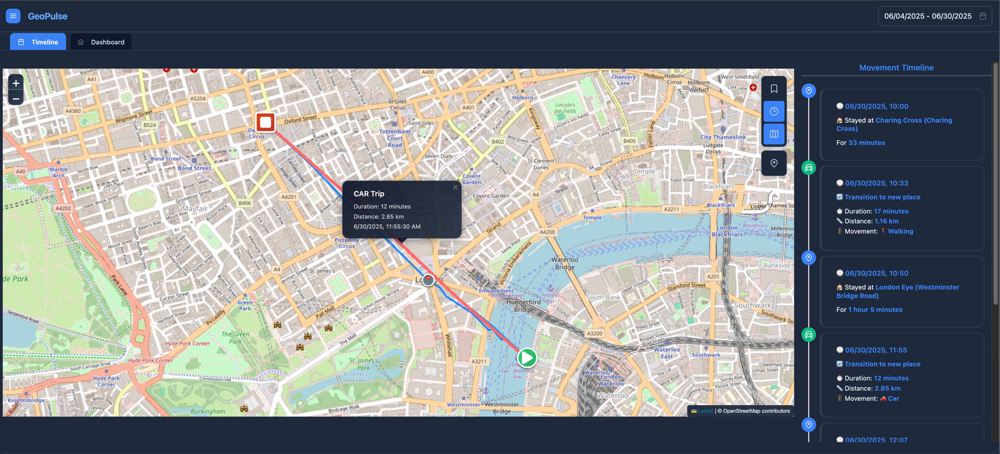
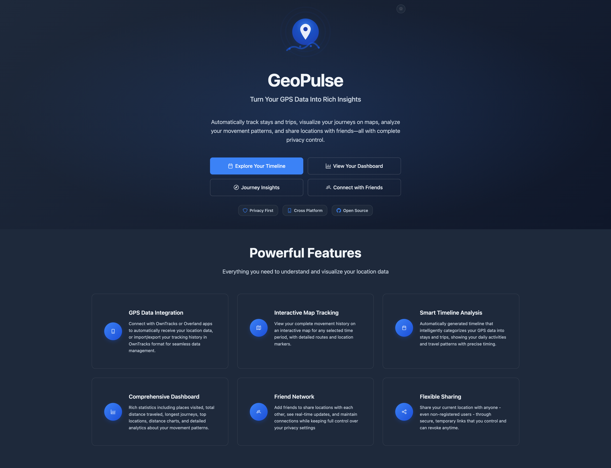
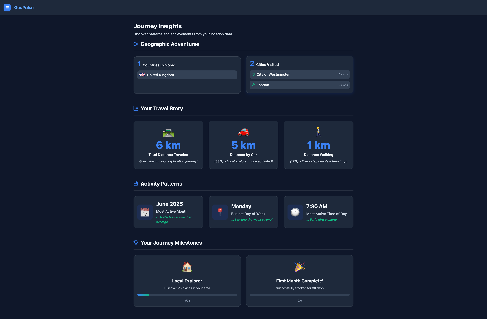
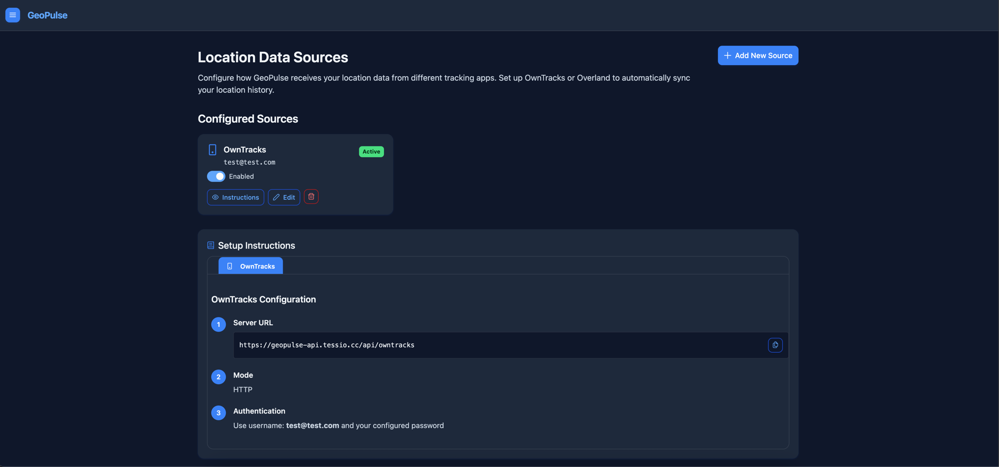
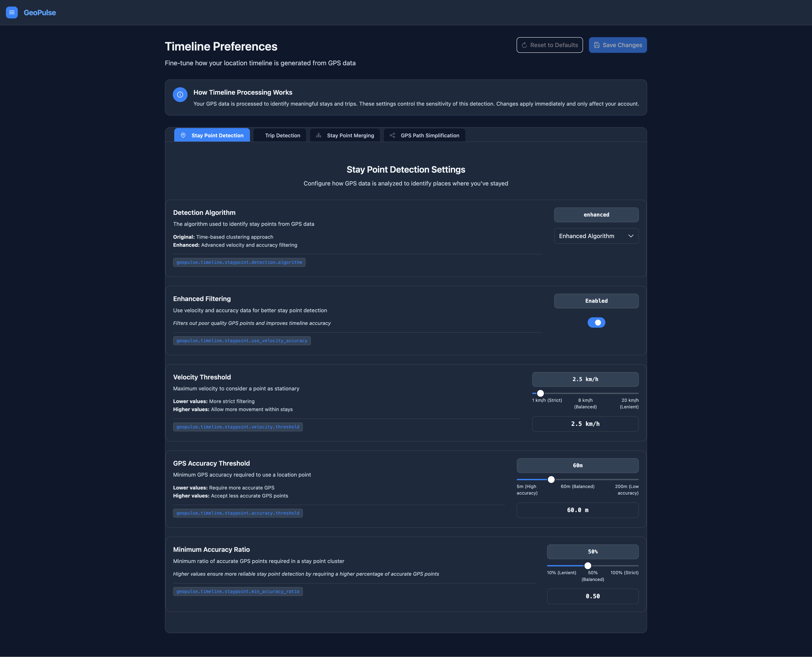
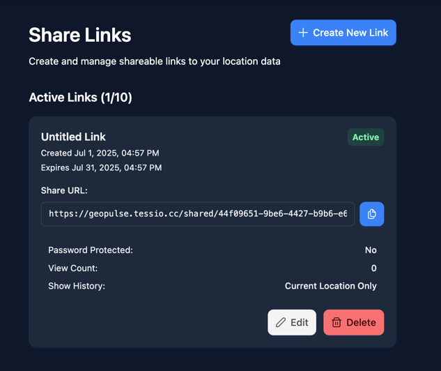
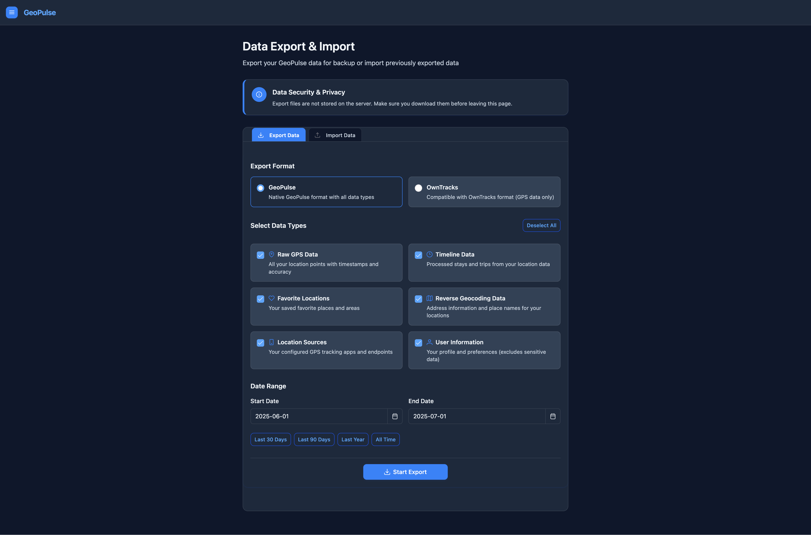

# GeoPulse

<div align="center">
  
  
  **Turn Your GPS Data Into Rich Insights**
  
  A self-hosted location tracking and analysis platform with intelligent timeline generation, social features, and comprehensive privacy controls.

  [](LICENSE)
  [](docs/DEPLOYMENT_GUIDE.md)
  [](#)
  [](#)
</div>

---

## 🎯 What is GeoPulse?

GeoPulse transforms raw GPS data from tracking apps like **OwnTracks** and **Overland** into meaningful insights about your movement patterns, places you visit, and journeys you take. It automatically categorizes your location data into **stays** and **trips**, providing an intelligent timeline of your daily activities while keeping your data completely under your control.

### 🗺️ See It In Action
<div align="center">
  
  <p><em>Smart timeline automatically categorizes your GPS data into meaningful stays and trips with interactive map visualization</em></p>
</div>

## 🚀 Quick Start
📖 **For detailed deployment instructions, see [docs/DEPLOYMENT_GUIDE.md](docs/DEPLOYMENT_GUIDE.md)**

## ✨ Key Features

### 📱 **GPS Data Integration**
- **OwnTracks & Overland Support** - Direct integration with popular tracking apps
- **Flexible Authentication** - Username/password or token-based connection
- **Import/Export** - Full OwnTracks format compatibility for data portability
- **Real-time Updates** - Automatic data synchronization from connected sources

### 🗺️ **Interactive Timeline & Maps**
- **Smart Timeline** - Automatically categorize GPS data into meaningful stays and trips
- **Interactive Maps** - Visualize your complete movement history with detailed routes
- **Date Range Flexibility** - View any time period from a single day to months of history
- **Real-time Tracking** - See current location when viewing today's data

### 📊 **Rich Analytics & Insights**
- **Dashboard Metrics** - Distance traveled, places visited, trip statistics
- **Journey Insights** - Countries and cities explored with achievement tracking
- **Movement Patterns** - Activity levels, streaks, and behavioral analysis
- **Top Places** - Most visited locations with detailed visit counts

### 👥 **Social Features**
- **Friend Network** - Connect with friends to share locations
- **Real-time Sharing** - See friends' current locations on the map
- **Privacy Controls** - Full control over what and when you share
- **Invitation System** - Email-based friend invitations and management

### 🔗 **Flexible Sharing**
- **Public Share Links** - Share your location with anyone, even non-registered users
- **Time-limited Access** - Set expiration dates for shared links
- **Password Protection** - Optional password protection for sensitive shares
- **Temporary Links** - Create secure, revocable sharing links

### ⭐ **Places & Favorites**
- **Favorite Locations** - Save important places and areas
- **Map Integration** - Add favorites directly from the map interface
- **Search & Management** - Organize and find your saved places easily

### ⚙️ **Customization & Control**
- **Timeline Preferences** - Adjust sensitivity settings for stay/trip detection
- **Data Export/Import** - Full control over your data with multiple export formats
- **Theme Support** - Dark and light mode with system preference detection
- **Mobile Optimized** - Fully responsive design for all devices

## 🏗️ Architecture

GeoPulse is built with a modern, scalable architecture designed for performance and maintainability:

- **Backend**: Java with Quarkus framework for high-performance REST APIs
- **Database**: PostGIS (PostgreSQL + Geographic Extensions) for spatial data
- **Frontend**: Vue.js 3 with Composition API, PrimeVue UI components
- **Maps**: Leaflet with OpenStreetMap for interactive mapping
- **State Management**: Pinia for reactive data management
- **Authentication**: Dual-mode JWT (localStorage for cross-domain, cookies for production)
- **Deployment**: Docker Compose with PostgreSQL, full containerization

## 📱 Compatible GPS Tracking Apps

### OwnTracks
- **Platform**: iOS, Android, Desktop
- **Authentication**: Username/Password
- **Features**: High-precision tracking, offline support, encryption
- **Setup**: Configure HTTP endpoint in OwnTracks settings

### Overland  
- **Platform**: iOS
- **Authentication**: Token-based
- **Features**: Battery-efficient tracking, background sync
- **Setup**: Add GeoPulse endpoint URL in Overland app

## 🛡️ Privacy & Security

GeoPulse is designed with **privacy-first principles**:

- ✅ **Self-Hosted** - Your data never leaves your server
- ✅ **No Third-Party Tracking** - No analytics, ads, or external data sharing
- ✅ **Secure Authentication** - JWT tokens with automatic refresh
- ✅ **HTTPS Required** - Encrypted connections for all communications
- ✅ **Granular Controls** - Choose exactly what to share and when
- ✅ **Data Ownership** - Export your data anytime in standard formats
- ✅ **CSRF Protection** - Comprehensive security against common attacks

### Authentication Modes
- **Cookie Mode (Production)**: Secure HttpOnly cookies with CSRF protection
- **localStorage Mode (Development/Cross-domain)**: JWT tokens in browser storage


## 📊 More Screenshots

### 🏠 Welcome Page
<div align="center">
  
  <p><em>Beautiful landing page with feature overview and easy navigation</em></p>
</div>

### 📊 Analytics & Insights

<details>
<summary>📈 <strong>Dashboard Overview</strong> (Click to expand)</summary>


*Comprehensive dashboard with activity statistics, distance traveled, and movement insights*

</details>

<details>
<summary>🎯 <strong>Journey Insights & Achievements</strong> (Click to expand)</summary>


*Explore countries visited, activity streaks, and personal achievements with beautiful visual displays*

</details>

### ⚙️ Configuration & Setup

<details>
<summary>📱 <strong>GPS Source Configuration</strong> (Click to expand)</summary>


*Easy setup for OwnTracks, Overland, and other GPS tracking apps with connection testing*

</details>

<details>
<summary>🎛️ <strong>Timeline Preferences</strong> (Click to expand)</summary>


*Fine-tune timeline generation algorithms with customizable sensitivity settings*

</details>

### 🔗 Sharing & Data Management

<details>
<summary>🔗 <strong>Share Links Management</strong> (Click to expand)</summary>


*Create secure, time-limited sharing links with password protection for non-GeoPulse users*

</details>

### 📊 Data Export & Import

<details>
<summary>📤 <strong>Data Export Options</strong> (Click to expand)</summary>


*Export your location data in multiple formats with flexible date range and data type selection*

</details>

<details>
<summary>📥 <strong>Data Import Interface</strong> (Click to expand)</summary>


*Import existing GPS data from OwnTracks or Overland other sources with progress tracking*

</details>


### Development Setup
```bash
# Clone repository
git clone https://github.com/tess1o/geopulse
cd geopulse

# Backend development
cd backend
./mvnw quarkus:dev

# Frontend development  
cd frontend
npm install
npm run dev
```

## 📄 License

GeoPulse is open source software released under the [MIT License](LICENSE).