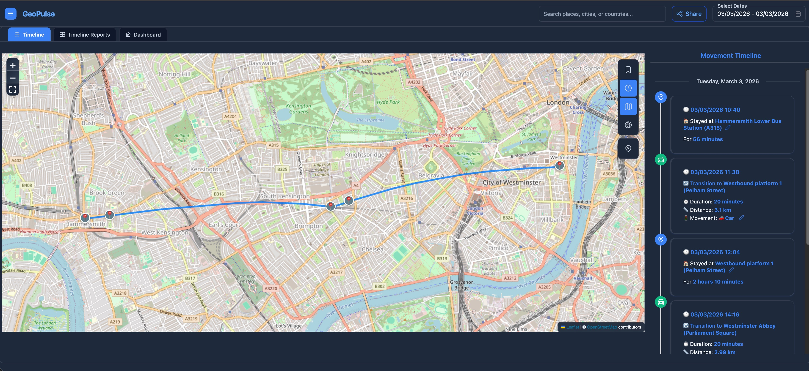
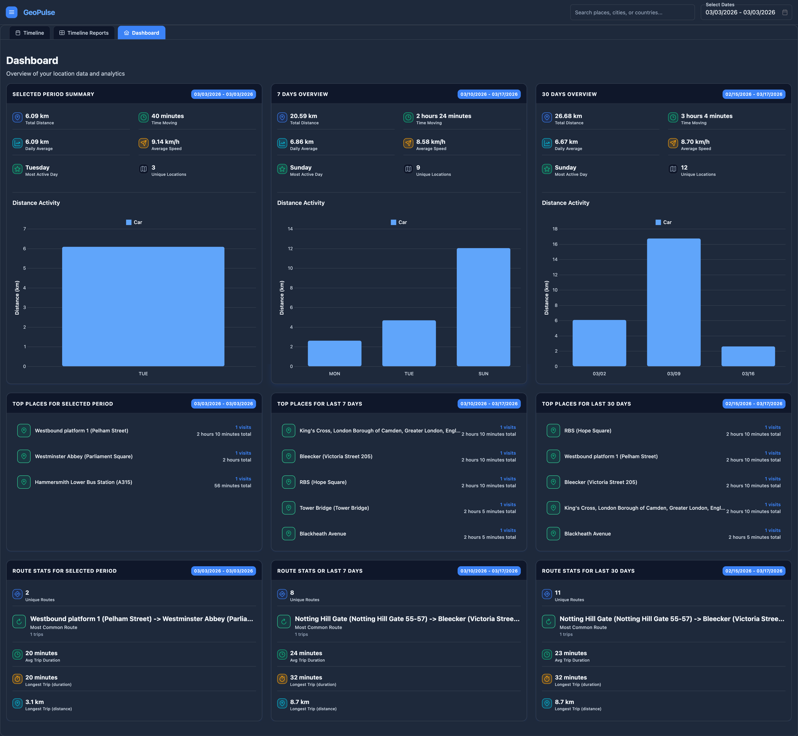
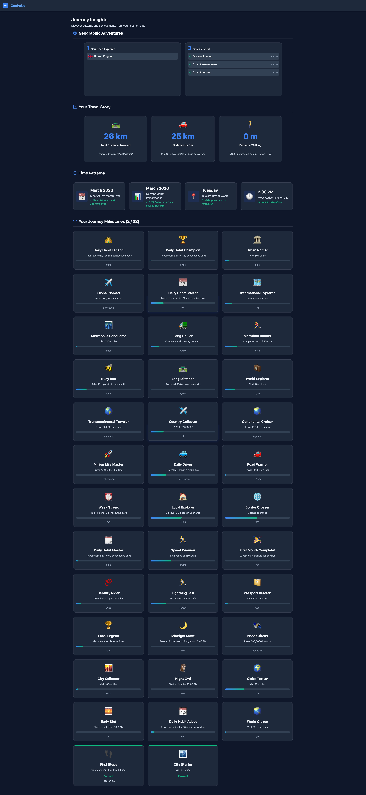
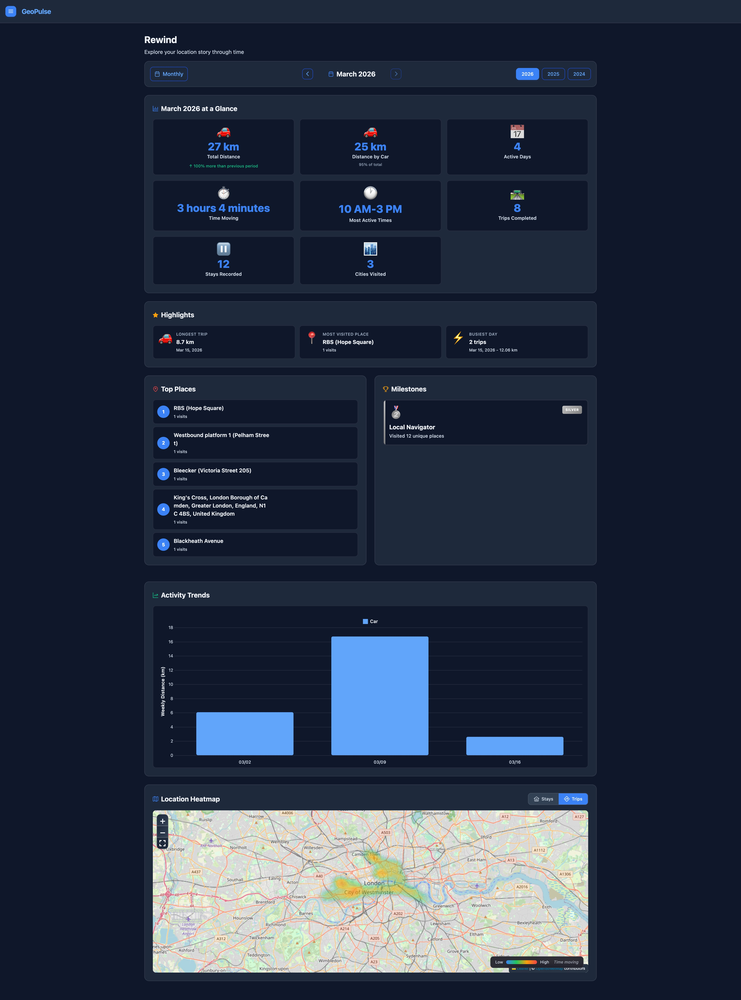
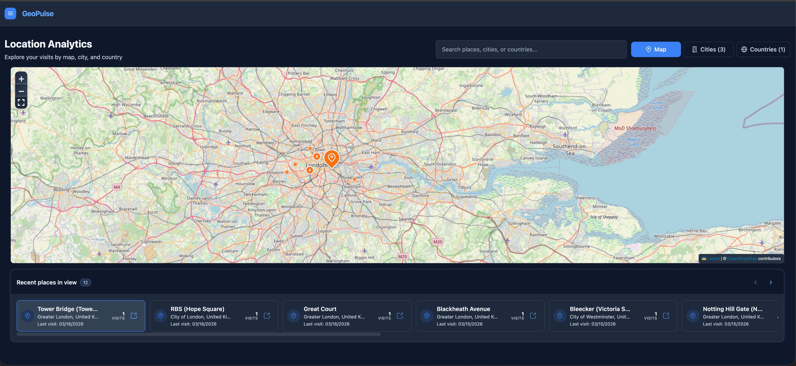
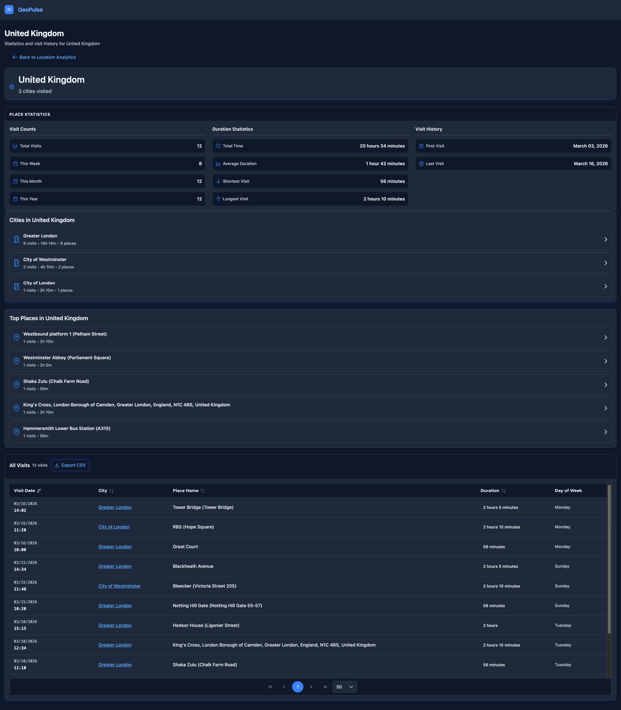
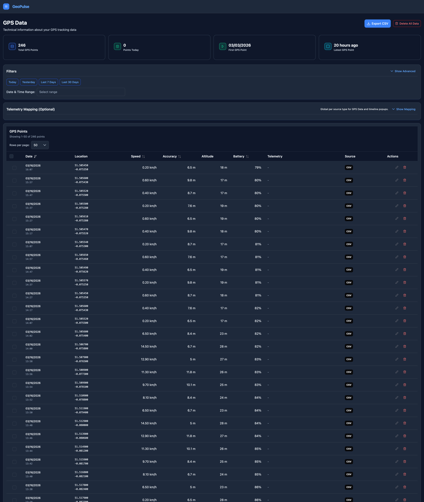
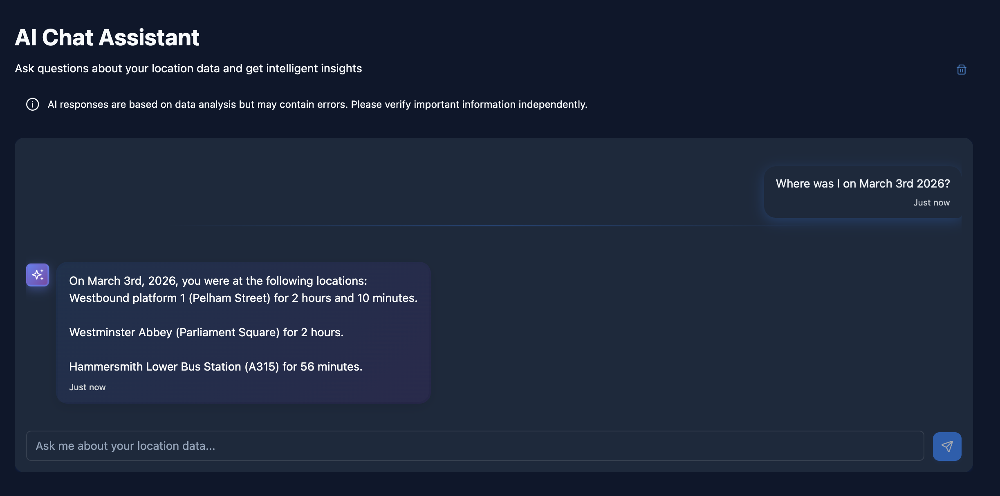

# GeoPulse

<p align="center">
  
</p>

<h3 align="center">The open-source, privacy-first Google Timeline alternative.</h3>

<p align="center">
  <a href="LICENSE"></a>
  <a href="https://tess1o.github.io/geopulse/docs/getting-started/deployment/docker-compose"></a>
  
  
</p>

GeoPulse transforms raw GPS data from OwnTracks, Overland, Dawarich, GPSLogger, Home Assistant, and other sources into a
searchable timeline of stays, trips, and movement patterns. It runs fully on your own infrastructure and integrates with
**Immich** so your photos appear directly on your map history.

<div align="center">
  
  <p><em>Comprehensive timeline visualization with automatic trip classification.</em></p>
</div>

---

## 🚀 1-Minute Install

```bash
# Create directory and download config
mkdir geopulse && cd geopulse
curl -L -o .env https://raw.githubusercontent.com/tess1o/GeoPulse/main/.env.example
curl -L -o docker-compose.yml https://raw.githubusercontent.com/tess1o/GeoPulse/main/docker-compose.yml

# Start
docker compose up -d
```

**Access:** [http://localhost:5555](http://localhost:5555)  
*Note: For production, review your `.env` for security-related settings first.*

Need MQTT, custom domains, or hardening? See
the [Docker Deployment Guide](https://tess1o.github.io/geopulse/docs/getting-started/deployment/docker-compose).

---

## Why GeoPulse

- **Privacy-first and self-hosted:** Your location data remains on your own infrastructure.
- **Open ecosystem:** Works with popular GPS apps (OwnTracks, Overland) and tools like Immich/Home Assistant.
- **Full data ownership:** Import historical data and export your data in standard formats anytime.
- **Lightweight runtime:** Typically under 100MB RAM and under 1% CPU in regular usage.

---

## Features

**Timeline & Analysis**

- **Smart Detection:** Automatically converts GPS points into stays, trips, and data gaps.
- **Custom Logic:** Fully configurable detection sensitivity and travel mode classification.
- **Deep Insights:** Analytics for distance, visit frequency, and movement patterns over time.
- **Immich Integration:** Photos from your library appear directly on your map timeline.

**Sources & Syncing**

- **Real-time Tracking:** Supports OwnTracks (HTTP/MQTT), Overland, GPSLogger, Home Assistant, Traccar, or Colota.
- **Universal Import:** Bulk import from Google Timeline, GPX, GeoJSON, OwnTracks exports, and CSV.

**Sharing & Privacy**

- **Friends System:** Per-user visibility controls for live location and history.
- **Guest Access:** Shareable links with optional password protection and instant revocation.
- **Multi-user Ready:** Built-in invitations, roles, and admin audit logs.
- **Enterprise Auth:** OIDC/SSO support alongside standard username/password login.

**Platform & Performance**

- **Lightweight:** Typically under 100MB RAM and 1% CPU usage.
- **Self-Sovereign:** No telemetry, no analytics beacons, and no third-party tracking.
- **Data Freedom:** Full data export and per-account deletion support.
- **Optional AI:** Bring your own OpenAI-compatible key for AI-assisted insights.

---

## 📸 Feature Tour

<details>
<summary>Click to expand gallery</summary>

### Dashboard

*High-level overview of your activity.*

### Journey Insights

*Global travel statistics, milestones, and badges.*

### Monthly Trends

*Monthly summaries and movement heatmap.*

### Location Analytics

*Map-first analytics similar to Timeline views.*

### Country/City Stats

*Track travels by country and city.*

### GPS Data Management

*Inspect and manage raw location points.*

### AI Assistant

*Natural-language queries for your data.*

</details>


## Deployment Options

### Docker Compose

Fastest path for local and single-server use. See
the [Full Docker Guide](https://tess1o.github.io/geopulse/docs/getting-started/deployment/docker-compose).

### Kubernetes / Helm

Best for managed clusters and advanced production. See
the [Helm Guide](https://tess1o.github.io/geopulse/docs/getting-started/deployment/helm-deployment).

```shell
helm repo add geopulse https://tess1o.github.io/geopulse/charts
helm repo update
helm install my-geopulse geopulse/geopulse
```

**Post-deployment steps:**

1. Set `GEOPULSE_ADMIN_EMAIL` to define the first admin.
2. Create an account with that email and finish setup in the Admin Panel.
3. See [Initial Setup Guide](https://tess1o.github.io/geopulse/docs/system-administration/initial-setup) for more.

---

## 📖 Docs & Next Steps

* **New users:** [Quick Start Guide](https://tess1o.github.io/geopulse/docs/getting-started/quick-start)
* **GPS setup:** [GPS Sources Overview](https://tess1o.github.io/geopulse/docs/user-guide/gps-sources/overview)
* **Deployment:** [Docker](https://tess1o.github.io/geopulse/docs/getting-started/deployment/docker-compose) | [Kubernetes](https://tess1o.github.io/geopulse/docs/getting-started/deployment/kubernetes-helm) | [Env Variables](https://tess1o.github.io/geopulse/docs/getting-started/deployment/environment-variables)
* **Administration:** [Admin Panel](https://tess1o.github.io/geopulse/docs/system-administration/configuration/admin-panel) | [OIDC/SSO](https://tess1o.github.io/geopulse/docs/system-administration/configuration/oidc-sso)
* **Maintenance:** [Backup & Restore](https://tess1o.github.io/geopulse/docs/system-administration/maintenance/backup-restore) | [Updating](https://tess1o.github.io/geopulse/docs/system-administration/maintenance/updating)
* **Full documentation:** [Documentation Portal](https://tess1o.github.io/geopulse/)

---

## 📜 License & Commercial Use

GeoPulse is licensed under the **Business Source License 1.1 (BSL 1.1)**.

- Free for personal, educational, and non-commercial use.
- Commercial use requires a separate commercial license.

See [LICENSE](./LICENSE) for full terms.  
For commercial licensing: `kerriden1@gmail.com`